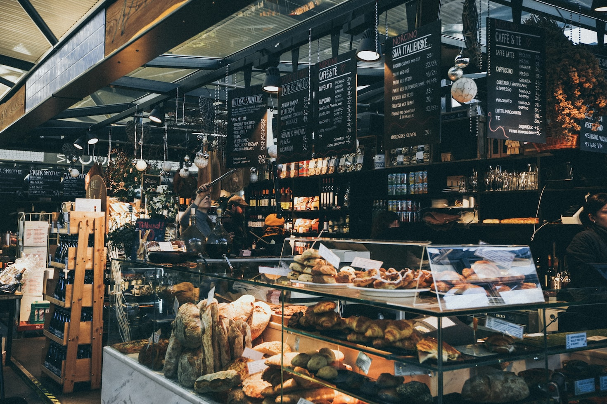

# Project - My First Website

This website project was developed during the `Code Fellows Code 102d48` course as a way to learn and get a feel for `HTML`, `CSS`, and `JavaScript`.

---

## About the Website

This site was meant to be a fun project showcasing some of my favorite desserts and the reason behind my choice, some serious and some for humor.

<!-- ### HTML Elements -->